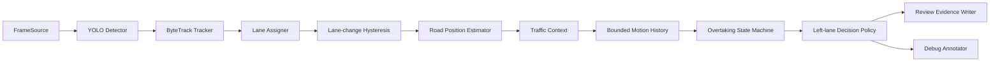

# Traffic AI: contextual left-lane review MVP

Traffic AI analyzes prerecorded highway video and creates explainable **human-review candidates** for prolonged left-lane use. Phase 2 adds motion history, stable lane changes, surrounding-traffic context, overtaking assessment, congestion suppression, and realistic right-lane opportunities.

This is decision-support software. It does not determine a legal violation, identify a person, read license plates, issue tickets, or contact police systems. Every event remains `pending_human_review` with `enforcement_action: none`.

## Architecture



```text
traffic_ai/
  app/
    main.py                       CLI and dependency composition
    config.py                     validated YAML configuration
    pipeline.py                   source-independent frame pipeline
    detection/                    detector protocol + Ultralytics adapter
    tracking/                     tracker protocol + ByteTrack adapter
    lanes/                        polygon lane assignment
    motion/                       bounded histories + lane hysteresis
    positioning/                  replaceable road-position estimation
    context/                      neighbors, congestion, right opportunities
    overtaking/                   policy protocol + overtaking state machine
    rules/                        occupancy lifecycle + decision policy
    events/                       review images, clips, and JSON evidence
    video/                        source/sink protocols + OpenCV adapters
    models/                       shared typed domain records
  configs/default.yaml
  input/
  output/
  tests/
  requirements.txt
```

Detection and tracking remain independent from traffic policy. `LeftLaneRuleEngine` receives only typed lane, history, context, and overtaking results; it never imports YOLO or ByteTrack. Future RTSP or drone sources can implement `FrameSource`, and a calibrated homography can replace `RoadPositionEstimator` without rewriting the rules.

## Phase 2 algorithm

For each frame the application:

1. Detects vehicles and assigns persistent track IDs.
2. Assigns each bottom-center road-contact point to a lane polygon.
3. Applies time-and-frame hysteresis before accepting a lane change, preventing boundary jitter from producing repeated transitions.
4. Maps the road-contact point to normalized road coordinates and estimates per-track longitudinal/lateral motion.
5. Finds the nearest vehicles ahead and behind in the same lane and adjacent right lane.
6. Stores those observations in a rolling history bounded by both seconds and sample count.
7. Estimates traffic density and normalized motion to label traffic `free_flow`, `moderate`, `dense`, `stop_and_go`, or `unknown`.
8. Tracks whether adequate front and rear space in the adjacent-right lane remains available for long enough.
9. Advances a per-track overtaking state machine.
10. Applies the contextual left-lane decision policy and emits only sufficiently supported review candidates.

The overtaking states are:

```text
NONE -> ENTERED_LEFT -> PASSING -> PASSED_TARGET
                                      |
                                      +-> RETURNING_RIGHT -> COMPLETED

Any incomplete/stale path may become ABORTED.
```

Strong overtaking evidence requires a confirmed move into the left lane near a vehicle ahead, followed by a reversal in their longitudinal ordering. Returning right adds completion evidence. Short related-track interruptions are tolerated; stale attempts expire.

After a pass is confirmed, the suspicious-occupancy clock restarts at pass completion. If the driver remains left after the configured grace period while the right lane is available, a new candidate may eventually be created. One legitimate overtake never grants permanent immunity.

## Candidate and suppression policy

Duration alone is no longer enough in the application pipeline. A candidate requires:

- the left-lane occupancy threshold to be exceeded;
- enough per-track history;
- free-flow traffic with adequate context confidence;
- no active or confirmed overtake;
- a safe-looking adjacent-right gap persisting for the configured duration;
- sufficient combined detector, traffic, right-gap, and overtaking evidence confidence.

The classifier exposes:

- `overtaking`
- `likely_overtaking`
- `congestion`
- `temporary_left_lane_use`
- `possible_left_lane_occupation`
- `insufficient_evidence`

Candidate reason codes are:

- `LEFT_LANE_DURATION_EXCEEDED`
- `NO_ACTIVE_OVERTAKE`
- `RIGHT_LANE_AVAILABLE`
- `FREE_FLOW_TRAFFIC`

Suppression reasons shown in rule status/debug video include:

- `DURATION_BELOW_THRESHOLD`
- `OVERTAKING_CONFIRMED`
- `ACTIVE_OVERTAKE`
- `CONGESTION`
- `RIGHT_LANE_UNAVAILABLE`
- `INSUFFICIENT_CONTEXT`
- `LOW_EVIDENCE_CONFIDENCE`

Uncertain context is intentionally classified as `insufficient_evidence` rather than promoted to a candidate.

## Coordinate and distance limitations

The initial `NormalizedImageRoadPositionEstimator` produces dimensionless values in the range 0-1. Longitudinal values increase in the configured direction of travel. Gap settings such as `0.08` are normalized image-space estimates, **not meters**.

Perspective distortion means equal normalized gaps at the near and far ends of an image do not represent equal physical distances. Do not interpret current motion as speed or gaps as real-world following distance. A future calibrated homography/world-coordinate estimator can implement the existing interface and label its output `calibrated_world`.

## Configuration

Edit [configs/default.yaml](configs/default.yaml) for every camera. The included polygons are illustrative. Lane entries must be ordered from left to right in the observed direction of travel, because that order defines the adjacent-right lane.

Key Phase 2 settings:

```yaml
road_position:
  mode: normalized_image
  travel_direction: toward_top

traffic_context:
  history_seconds: 12.0
  minimum_history_seconds: 2.0
  maximum_samples_per_track: 900

lane_change:
  confirmation_seconds: 0.4
  minimum_frames: 3

overtaking:
  enabled: true
  observation_window_seconds: 10.0
  completion_timeout_seconds: 15.0
  minimum_confidence: 0.65
  entry_target_max_gap_normalized: 0.20
  pass_order_margin_normalized: 0.01
  post_overtake_grace_seconds: 2.0

congestion:
  dense_vehicle_count_per_lane: 3
  dense_density_ratio: 0.80
  stop_and_go_max_motion_per_second_normalized: 0.015

right_lane_opportunity:
  minimum_available_seconds: 3.0
  front_gap_normalized: 0.08
  rear_gap_normalized: 0.06

rules:
  left_lane:
    occupancy_threshold_seconds: 8.0
    minimum_evidence_confidence: 0.65
    overtaking_clearance_mode: contextual
    policy_version: "2.0"
```

All thresholds are validated by Pydantic. Older configurations without Phase 2 sections continue with defaults. The legacy value `overtaking_clearance_mode: none` is accepted, but contextual application decisions then treat overtaking as unassessed and suppress candidates as insufficient evidence.

## Setup

Python 3.11 or newer is required. From the repository root:

PowerShell:

```powershell
python -m venv .venv
.\.venv\Scripts\Activate.ps1
python -m pip install --upgrade pip
python -m pip install -r requirements.txt
```

macOS/Linux:

```bash
python3 -m venv .venv
source .venv/bin/activate
python -m pip install --upgrade pip
python -m pip install -r requirements.txt
```

The first use of a model name such as `yolo11n.pt` may download model weights. Supply a local model with `--model` when required.

## Run

Calibrate `configs/default.yaml`, then analyze an MP4:

```powershell
python -m app.main --config configs/default.yaml --input input/highway.mp4
```

Common overrides:

```powershell
python -m app.main `
  --config configs/default.yaml `
  --input C:\path\to\highway.mp4 `
  --output-dir output `
  --model yolo11n.pt `
  --device cpu
```

For a CUDA device supported by the installed PyTorch build, use `--device 0`.

## Output and evidence

```text
output/highway_YYYYMMDD_HHMMSS/
  annotated.mp4
  events.jsonl
  events/
    left_lane_track_17_0000012500/
      metadata.json
      representative.jpg
      event.mp4
```

The debug video shows vehicle ID, stable lane, left-lane duration, overtake state, right-gap duration, candidate/suppression state, overall traffic state, and a subtle line to a related overtaken track when visible.

Phase 2 keeps all Phase 1 metadata fields and adds:

```json
{
  "event_type": "left_lane_review_candidate",
  "review_status": "pending_human_review",
  "human_review_required": true,
  "enforcement_action": "none",
  "policy_version": "2.0",
  "behavior_classification": "possible_left_lane_occupation",
  "evidence_confidence_score": 0.79,
  "traffic_context": {
    "congestion_level": "free_flow",
    "traffic_density": 0.31,
    "nearby_vehicle_count": 3,
    "right_lane_available": true,
    "right_lane_available_seconds": 4.7,
    "coordinate_system": "normalized_image",
    "calibrated": false,
    "confidence": 0.82
  },
  "overtaking_assessment": {
    "status": "not_overtaking",
    "state": "NONE",
    "confidence": 0.78,
    "evidence": ["no_active_overtaking_sequence_detected"],
    "related_track_ids": []
  },
  "review_reason_codes": [
    "LEFT_LANE_DURATION_EXCEEDED",
    "NO_ACTIVE_OVERTAKE",
    "RIGHT_LANE_AVAILABLE",
    "FREE_FLOW_TRAFFIC"
  ]
}
```

The metadata contains track-level technical evidence only and no personal identity data.

## Test and lint

The test suite is model-independent and does not download YOLO weights:

```powershell
python -m pytest -q
python -m ruff check app tests
python -m ruff format --check app tests
```

It covers lane hysteresis, boundary jitter, overtaking suppression, free-right-lane candidates, dense traffic, blocked right lanes, temporary tracker loss, return-right completion, post-overtake renewed occupancy, and metadata serialization.

## Remaining limitations

- Static lane polygons assume a fixed camera; moving drone footage needs stabilization.
- Normalized image positions are perspective-distorted and cannot provide meters or physical speed.
- Tracker ID switches or long occlusion can break an overtaking relationship.
- Congestion and gap thresholds require site-specific validation.
- Only the immediately adjacent-right lane is evaluated.
- The logic does not understand road signs, temporary closures, emergency maneuvers, weather, or jurisdiction-specific exceptions.
- Detection absence is not proof that a lane is empty; human reviewers must inspect the saved evidence.
- No automatic enforcement, identity recognition, or legal determination is implemented.
