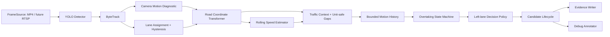

# Traffic AI: explainable left-lane review MVP

Traffic AI analyzes prerecorded highway video and creates evidence packages for a human operator to review. Phase 3 adds an explicit candidate lifecycle, optional road-plane homography, unit-safe gaps, approximate calibrated speed, confidence-aware degradation, and a camera-motion extension point.

This is decision-support software—not an enforcement system. It does not identify people, read license plates, determine a legal violation, issue fines, or contact police systems. Finalized events always retain `human_review_required: true` and `enforcement_action: none`.

## Architecture and data flow



Detection, tracking, camera motion, geometry, speed, context, overtaking, rules, lifecycle, rendering, and persistence are separate modules. None of the domain policies import YOLO or ByteTrack. A future RTSP/drone source can implement `FrameSource`; a future stabilizer can be inserted before coordinate transformation without moving homography or speed logic into the rule engine.

```text
traffic_ai/
  app/
    main.py                 CLI and dependency composition
    pipeline.py             source-independent analysis loop
    config.py               strict Pydantic configuration
    detection/              detector protocol + Ultralytics adapter
    tracking/               tracker protocol + ByteTrack adapter
    camera_motion/          fixed-camera + experimental feature diagnostic
    lanes/                  polygons, assignment, adjacent-lane ordering
    positioning/            normalized and homography transformers
    speed/                  robust rolling physical-speed estimator
    motion/                 bounded histories + lane-change hysteresis
    context/                congestion, neighbors, unit-safe gaps
    overtaking/             contextual state machine
    rules/                  left-lane policy and orchestration
    candidates/             explicit evidence lifecycle
    events/                 images, clips, JSON metadata and indexes
    video/                  OpenCV source/sink and debug annotation
    tools/                  calibration visualization utility
    models/                 framework-neutral typed records
  configs/
    default.yaml            safe uncalibrated configuration
    calibrated_example.yaml PLACEHOLDER calibration example
  tests/                    synthetic/model-independent tests
```

## Candidate lifecycle

Candidate start and continuation are separate decisions:

```text
IDLE → ACCUMULATING → CANDIDATE_ACTIVE ↔ SUSPENDED
                                      ↘ CANCELLED
                                      ↘ FINALIZED
```

- `ACCUMULATING`: left-lane evidence exists but the policy threshold/context gate has not passed.
- `CANDIDATE_ACTIVE`: start conditions passed; an evidence package is recording.
- `SUSPENDED`: later context temporarily invalidated the evidence, such as a blocked right lane.
- `CANCELLED`: invalidity persisted beyond its configured grace period. Evidence remains on disk but is not submitted as pending review.
- `FINALIZED`: evidence is complete and immutable; it is submitted for mandatory human review.

`CONGESTION`, `ACTIVE_OVERTAKE`, `OVERTAKING_CONFIRMED`, unreliable calibration, unstable tracking, and high camera motion use the invalidation grace. Other temporary context failures use the suspension grace. A valid context can resume within grace. Finalized events cannot later become cancelled. A cancelled episode can restart only after cooldown and a fresh eligible decision, so a completed overtake does not permanently exempt later suspicious occupancy.

```yaml
candidate_lifecycle:
  invalidation_grace_seconds: 2.0
  suspension_grace_seconds: 3.0
  finalize_after_seconds: 5.0
  restart_cooldown_seconds: 1.5
  maximum_decision_history_entries: 32
```

Decision history records only meaningful state changes, not every frame, and is bounded.

## Calibration and coordinate modes

The default is safe uncalibrated operation:

```yaml
calibration:
  mode: normalized
  fallback_to_normalized: true
```

`NormalizedImageRoadPositionEstimator` retains pixel contact points plus dimensionless normalized coordinates. It can order vehicles and calculate normalized motion/gaps, but it never emits meters or km/h.

For a fixed camera, configure corresponding image pixels and measured points on the road plane:

```yaml
calibration:
  mode: homography
  world_units: meters
  image_points:
    - [410, 720]
    - [880, 720]
    - [690, 420]
    - [590, 420]
  world_points:
    - [0.0, 0.0]
    - [12.0, 0.0]
    - [12.0, 50.0]
    - [0.0, 50.0]
  fallback_to_normalized: false
  maximum_reprojection_error_pixels: 5.0
  minimum_confidence_for_physical_measurements: 0.55
```

The values in [configs/calibrated_example.yaml](configs/calibrated_example.yaml) are explicitly placeholders. Measure at least four non-collinear, one-to-one correspondences for the actual camera. Good choices are surveyed lane-marker corners or other stationary road points whose planar distances are known. Spread points across the analysis region; clustered points extrapolate poorly.

Startup validates counts, uniqueness, non-collinearity, matrix solvability, finite projection, supported units, and inverse pixel reprojection error. The matrix is computed once. A structurally invalid config is rejected. A runtime homography failure only activates normalized mode when `fallback_to_normalized: true`, and metadata reports `homography_fallback`; fake physical values are never produced.

Every track preserves:

- `image_position`: bottom-center contact point in pixels;
- `normalized_position`: dimensionless image-space position;
- `world_position`: projected road-plane point, or `null` without a homography;
- effective `coordinate_mode` and calibration confidence.

A homography assumes the relevant vehicle contact points lie approximately on the calibrated road plane. Bridges, slopes, raised objects, and inaccurate contact points violate that assumption. Large drone altitude, pitch, roll, yaw, or translation changes alter the image-to-road mapping and invalidate a static homography; recalibration or dynamic stabilization/pose estimation is required.

## Speed, gaps, and right-lane opportunity

Approximate physical speed uses a robust rolling road-plane displacement estimator. It requires calibrated meter coordinates, enough samples/time, and acceptable camera/tracker quality. Teleport-like jumps, long tracker gaps, excessive camera movement, and implausible highway speeds are rejected or reset. `speed_kph` is always `null` in normalized mode; `normalized_motion_rate` may still be available and is labeled separately.

```yaml
speed_estimation:
  enabled: true
  minimum_window_seconds: 0.8
  maximum_window_seconds: 2.5
  minimum_samples: 5
  smoothing: median
  max_reasonable_speed_kph: 220
  max_position_jump_meters: 20
  tracker_gap_grace_seconds: 0.5
```

Speed is approximate—not speed-enforcement evidence. Error depends on surveyed points, lens distortion, tracking stability, contact-point accuracy, frame timestamps, and how well the road matches a plane.

Gap metadata is a typed value with `value`, `unit`, `confidence`, and `coordinate_mode`. Meter and normalized thresholds cannot be confused:

```yaml
right_lane_opportunity:
  mode: auto
  minimum_front_gap_m: 20.0
  minimum_rear_gap_m: 15.0
  front_gap_normalized: 0.08
  rear_gap_normalized: 0.06
  minimum_available_seconds: 3.0
```

`auto` uses meters only when calibrated positions are trustworthy, otherwise normalized thresholds. `calibrated` marks opportunity unavailable on uncalibrated input; it never treats a normalized value as meters. Calibrated ordering, gaps, and relative speed strengthen overtaking evidence such as `TARGET_GAINING_ON_VEHICLE`, `RELATIVE_ORDER_CHANGED`, `TARGET_PASSED_VEHICLE`, and `RETURNED_RIGHT`. Speed is helpful but never mandatory.

## Camera motion and drones

`camera_motion.mode: none` is the fixed-camera default. The optional `feature_based` implementation uses background features, Lucas–Kanade optical flow, vehicle-box masks, and a robust partial-affine estimate. It reports translation, rotation, confidence, and motion level for diagnostics and decision degradation; it does not warp/stabilize frames and is not production-grade drone stabilization.

Detection currently runs on raw frames, then tracked vehicle boxes are excluded from the diagnostic motion estimate before coordinate transformation. This ordering lets the experimental estimator avoid moving objects. A future full stabilizer should expose both a stabilized frame and transform and run before detection/road positioning, with lane geometry and homography updated consistently.

## Calibration preview

Save an annotated frame with calibration points, projected world grid, lane polygons, and quality status:

```powershell
python -m app.tools.visualize_calibration `
  --video input/highway.mp4 `
  --config configs/calibrated_example.yaml `
  --output output/calibration_preview.jpg
```

Add `--frame-index 100` to inspect another frame or `--show` for an optional OpenCV window. Saving works without a GUI.

## Setup and run

Python 3.11 or newer is required. From the repository root on PowerShell:

```powershell
python -m venv .venv
.\.venv\Scripts\Activate.ps1
python -m pip install --upgrade pip
python -m pip install -r requirements.txt
python -m app.main --config configs/default.yaml --input input/highway.mp4
```

macOS/Linux:

```bash
python3 -m venv .venv
source .venv/bin/activate
python -m pip install --upgrade pip
python -m pip install -r requirements.txt
python -m app.main --config configs/default.yaml --input input/highway.mp4
```

Optional CLI overrides:

```powershell
python -m app.main `
  --config configs/default.yaml `
  --input C:\path\to\highway.mp4 `
  --output-dir output `
  --model yolo11n.pt `
  --device cpu
```

The first model-name use may download YOLO weights. Lane polygons in the default config are illustrative and must be adjusted for the camera.

## Output and metadata

```text
output/highway_YYYYMMDD_HHMMSS/
  annotated.mp4
  events.jsonl                 finalized, pending-human-review records only
  cancelled_events.jsonl       invalidated evidence, never pending review
  events/
    left_lane_track_17_0000012500/
      metadata.json
      representative.jpg
      event.mp4
```

Phase 3 metadata includes lifecycle timestamps/cancellation reason, bounded decision history, all coordinate representations, calibration quality, camera motion, approximate speed mode/confidence, gap units/mode, congestion, overtaking state/evidence, and policy reason codes. Cancelled records use `review_status: cancelled`; finalized records use `review_status: pending_human_review`.

The debug video can show track ID, lane, coordinate mode, approximate calibrated speed or `N/A`, left-lane duration, overtake state, right-lane gap with unit, lifecycle, suppression/candidate status, traffic state, calibration quality, and camera-motion level. Advanced fields can be disabled in `output` config.

## Tests and checks

Tests use synthetic geometry and fake video writers; they do not load YOLO weights:

```powershell
python -m pytest -q
python -m ruff check app tests
python -m ruff format --check app tests
python -m compileall -q app tests
```

Coverage includes Phase 2 behavior plus known-point homography mapping, invalid calibration, normalized fallback, coordinate preservation, meter/normalized gap separation, constant physical motion, jump rejection, tracker dropout, uncalibrated speed gating, lifecycle start/suspend/resume/cancel/finalize/restart, low-quality degradation, and cancelled-event persistence.

## Performance and known limitations

- Homography and calibration validation run once at startup; track/speed/history buffers are bounded. The debug frame copy and experimental optical flow are the main optional per-frame costs.
- Static lane polygons and a static homography primarily target fixed cameras. The feature diagnostic does not make moving-drone measurements reliable.
- Four exact correspondences can have low residual error yet still describe a poorly surveyed region; inspect the projected grid and validate against known distances.
- Tracker ID switches and long occlusions can still break speed/overtaking relationships.
- Detection absence is not proof a lane is empty. Congestion, gap, and policy thresholds require site-specific validation.
- Lens distortion is not currently modeled; undistort footage before calibration when distortion is material.
- The system does not interpret signs, closures, roadworks, emergency maneuvers, weather, or jurisdiction-specific exceptions.
- All outputs are review candidates. Human judgment remains mandatory and no automatic enforcement is implemented.
